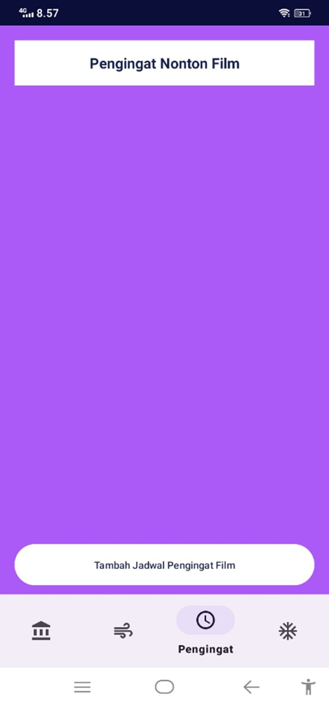

# Penjelasan Aplikasi TV Maze

**TV Maze** adalah nama aplikasi yang saya buat, di mana di dalamnya menampilkan daftar film berdasarkan data dari **API TV Maze**. Data dari API difilter agar hanya menampilkan film yang memiliki **kata kunci "Batman"**. Dengan demikian, pengguna hanya akan melihat film-film bertema Batman saja di halaman aplikasi.

Berikut adalah fitur-fitur utama dari aplikasi **TV Maze**:

---

## 1. Halaman Login

Halaman pertama yang akan muncul ketika pengguna membuka aplikasi adalah **halaman Login**.  
Di halaman ini, pengguna wajib melakukan login terlebih dahulu sebelum dapat mengakses aplikasi.

Pilihan login yang tersedia:
- Membuat akun baru dengan mengklik tombol **Register**
- Login dengan akun yang sudah dibuat sebelumnya
- Login menggunakan **akun Google**

Fitur login ini memastikan setiap pengguna memiliki sesi tersendiri yang aman. 

Berikut tampilan halaman-halaman tersebut:

### 📝 Tampilan Halaman Register

---

### 🔐 Tampilan Halaman Login dengan Akun yang Sudah Dibuat

---

### 🌐 Tampilan Halaman Login Menggunakan Akun Google

---

## 2. Halaman Home (Beranda)

Setelah berhasil login, pengguna akan diarahkan ke halaman utama yaitu **Home**.

Di halaman ini, akan ditampilkan daftar film bertema **Batman** yang diambil dari API. Informasi yang ditampilkan dalam daftar film meliputi:
- Poster film  
- Judul film  
- Tanggal rilis  
- Status  
- Rating (ditampilkan dalam bentuk bintang)

### 📝 Tampilan Halaman Home setelah login berhasil

---

## 3. Halaman Konten (Search / Pencarian)

Pada halaman ini terdapat fitur **search (pencarian)** yang memungkinkan pengguna mencari film berdasarkan **kata kunci** yang mereka masukkan.  
Data film akan ditampilkan sesuai hasil pencarian dari API TV Maze berdasarkan input pengguna.

### 📝 Tampilan Halaman Konten

---

## 4. Halaman Pengingat (Reminder)

Di halaman **Reminder**, pengguna bisa membuat pengingat untuk menonton film dengan langkah berikut:
- Klik tombol **Tambah Pengingat**
- Isi data berupa:
  - Judul film
  - Tanggal dan jam pengingat
  - Upload atau ambil foto dari galeri atau kamera (menggunakan sensor kamera perangkat)
 
 ### 📝 Tampilan Halaman Pengingat

---

Setelah data diisi, klik **Tambah Pengingat**, dan:
- Data pengingat akan langsung tampil
- Muncul pop-up bahwa reminder berhasil disimpan
- Notifikasi otomatis akan muncul saat waktu yang telah diatur tiba

### 📝 Tampilan halaman saat mengisi inputan

---

### 📝 Tampilan halaman saat reminder berhasil disimpan

---

### 📝 Tampilan halaman saat notifikasi masuk

---

## 5. Halaman Pengaturan (Settings)

Pada halaman **Settings**, pengguna bisa memilih **tema warna latar belakang aplikasi** sesuai keinginan.

Pilihan tema yang tersedia:
- Tema **Default (Putih)**
- Tema **Navy**
- Tema **Hitam**
- Tema **Pink**
- Tema **Ungu**

Setiap kali pengguna memilih salah satu tema, latar belakang aplikasi akan berubah secara otomatis sesuai pilihan tersebut.

Dibawah adalah contoh penggunaan tema-tema bagian halaman settings.

### 📝 Tampilan Halaman dengan  tema Putih

'/
  
  &nbsp;
  
  &nbsp;
  
  &nbsp;
  

---

### 🔐 Tampilan Halaman dengan tema Navy

'/
  
  &nbsp;
  
  &nbsp;
  
  &nbsp;
  

---

### 🌐 Tampilan Halaman dengan  tema Hitam

'/
  
  &nbsp;
  
  &nbsp;
  
  &nbsp;
  

---

### 🔐 Tampilan Halaman dengan tema Pink

'/
  
  &nbsp;
  
  &nbsp;
  
  &nbsp;
  

---

### 🌐 Tampilan Halaman dengan  tema Ungu

'/
  
  &nbsp;
  
  &nbsp;
  
  &nbsp;
  

---

