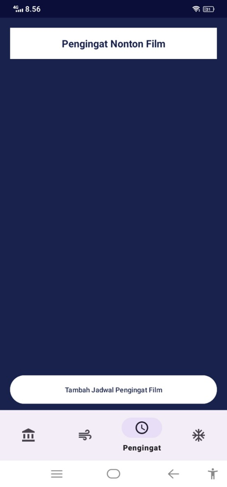

# 🎬 TV Maze App

TV Maze adalah aplikasi Android yang menampilkan daftar film dari API TV Maze. Aplikasi ini dibuat dengan memfilter data API hanya menampilkan film dengan **keyword "Batman"**. Aplikasi ini memiliki berbagai fitur menarik, mulai dari pencarian film, pengingat untuk menonton film, pengaturan tema, serta sistem login.

---

## 📸 Screenshot Aplikasi

> (Tambahkan gambar ke dalam folder `screenshots/` lalu ubah path-nya di bawah sesuai nama file)

---

## 🧾 Penjelasan Proyek

Aplikasi ini dinamakan **TV Maze**, yang menampilkan daftar film berdasarkan **API dari TV Maze**. Data difilter sehingga hanya film dengan keyword **Batman** yang akan ditampilkan di halaman utama.

### Halaman Utama (Home)
Menampilkan:
- Poster film
- Judul film
- Tanggal penayangan
- Rating (bintang)

### Halaman Konten (Search)
- Fitur search film dari API TV Maze
- Menampilkan hasil pencarian berdasarkan input pengguna

### Halaman Pengingat (Reminder)
- Menambahkan pengingat menonton film
- Input judul film, tanggal, dan jam
- Menambahkan gambar dari kamera atau galeri
- Menggunakan sensor kamera perangkat

### Halaman Pengaturan (Settings)
- Mengubah warna latar belakang aplikasi
- Pilihan beberapa tema warna

### Login & Register
- Login menggunakan akun manual atau akun Google
- Jika belum memiliki akun, pengguna harus register terlebih dahulu

---

## ✅ Fitur-Fitur yang Telah Dikerjakan

- [x] Integrasi API TV Maze
- [x] Filter data dengan keyword "Batman"
- [x] Tampilan daftar film dengan RecyclerView
- [x] Navigasi antar halaman (Bottom Navigation)
- [x] Fitur pencarian film
- [x] Tambah pengingat film + unggah foto
- [x] Akses kamera dan galeri
- [x] Notifikasi pengingat (AlarmManager)
- [x] Pengaturan tema aplikasi
- [x] Login manual & Google login

---

## 🛠️ Teknologi yang Digunakan

- Java (Android Studio)
- REST API (TV Maze)
- RecyclerView
- AlarmManager
- CameraX / Intent Kamera
- SharedPreferences
- Firebase Authentication (opsional)
- Glide / Picasso

---

## 🧠 Tujuan Pembuatan

Proyek ini dibuat dalam rangka tugas eksplorasi API dengan tujuan:
- Meningkatkan kemampuan mengonsumsi REST API di Android
- Memahami manajemen data & tampilan modern
- Menerapkan fitur autentikasi dan pengingat lokal
- Mengatur tampilan dan preferensi pengguna

---

## 🙋 Tentang Pengembang

**👩‍💻 Siti Aisyah**  
Universitas Lambung Mangkurat  
Program Studi Pendidikan Ilmu Komputer  
GitHub: [@username](https://github.com/username)  
Email: [alamat email]

---

> Jika kamu menyukai proyek ini, silakan ⭐ repo-nya dan fork untuk pengembangan lebih lanjut!
